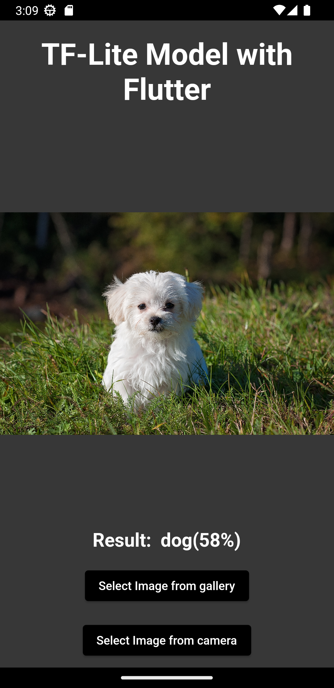

# TF-Lite Model Implementation with Flutter

This is a sample Flutter application that demonstrates how to use a TF-Lite model with Flutter using method channel calls without flutter tflite package.

## Demo
Sample app images:


## How this app works?

### 1. Add Dependencies:
First, you should have to add tflite dependencies in your app level build.gradle file 
Project -> Android -> app -> build.gradle

```gradle
dependencies {
    implementation "org.jetbrains.kotlin:kotlin-stdlib-jdk7:$kotlin_version"
    //For delegating GPU
    implementation 'org.tensorflow:tensorflow-lite-gpu-delegate-plugin:0.4.0'
    implementation 'org.tensorflow:tensorflow-lite-gpu:2.9.0'
    //TF lite
    implementation 'org.tensorflow:tensorflow-lite-task-vision:0.4.1'
}
```
Also change your minsdkversion to atleast 21 (In same File)

```gradle
minSdkVersion 21
```

### 2. Add your TF-Lite Model:
Create assets folder in your android app path
Project -> android -> app -> source -> main -> assets

In this Porject I use efficientdet-lite0.tflite model for objectDetection

### 3. Get the images from gallery or camera:

In this project I use the Flutter ``` image_picker ``` package for getting the images from camera or gallery.

``` dart
void pickImageFromGallery() {
    final ImagePicker picker = ImagePicker();

    picker.pickImage(source: ImageSource.gallery).then((image) {
      setState(() {
        if (image != null) {
          imagePath = image.path;
          result = '';
          runModel(image.path);
        }
      });
    });
  }

  void pickImageFromCamera() {
    final ImagePicker picker = ImagePicker();

    picker
        .pickImage(source: ImageSource.camera, imageQuality: 50)
        .then((image) {
      setState(() {
        if (image != null) {
          imagePath = image.path;
          result = '';
          runModel(image.path);
        }
      });
    });
  }
```


### 4. Method Channel Call to Native:
First we will create a method for method channel call of flutter with kotlin.

```dart
//------Platform channel for native call-----------------------------------
  static const platform = MethodChannel('RunModel');

  //-----Call to native for running TF-lite model---------------------------
  Future<void> runModel(String path) async {
    try {
      var result =
          await platform.invokeMethod('objectDetection', {'path': path});
      /*
        ****NOTE*****
        var result is in the from of List<Map<String,String>>
        eg.
        [
          {
            'name' : 'Object Name',
            'confidence' : '90%',
            'boundingBox' : '10.0, 20.0, 30.0, 40.0',
            'width' : '100',
            'height' : '100' //Height and width of image
          },
          ....... and so on
        ]
       */

      getObjectsInfo(result);
    } on PlatformException catch (error) {
      ScaffoldMessenger.of(context)
          .showSnackBar(SnackBar(content: Text(error.toString())));
    }
  }

```
In Method Channel call send the path of your selectd image to kotlin.


## Kotlin Part:

### 5. Configure Flutter Engine:

In your ``` MainAcitvity.kt ``` file write a method for communicating with Flutter.

``` kotlin
 /*
  * Channel name through which we communicate with flutter app
  */
    private val CHANNEL = "RunModel"

    override fun configureFlutterEngine(@NonNull flutterEngine: FlutterEngine) {
        super.configureFlutterEngine(flutterEngine)
        MethodChannel(flutterEngine.dartExecutor.binaryMessenger, CHANNEL).setMethodCallHandler {
                call,
                result ->
            val args = call.arguments as HashMap<*, *>
            if (call.method == "objectDetection") {
                result.success(runObjectDetection(args["path"].toString()))
            } else {
                result.notImplemented()
            }
        }
    }
```

### 6. Run Model:
In this project I implement objectDetection on image.

Get the image from the given path and convert it into bitmap:

``` kotlin
    // -----Convert the image from url into bitmap
    fun convertBitmap(imageUri: String): Bitmap {
        val bitmap: Bitmap = BitmapFactory.decodeFile(imageUri)
        return bitmap
    }
```

Run Ojbect Detection on image bitmap.

``` kotlin
    private fun runObjectDetection(
        imageUri: String,
    ): List<HashMap<String, String>> { // Use ByteArray if you want to return U8list

        // -------List of detected objects------
        var finalRes: MutableList<HashMap<String, String>> = mutableListOf<HashMap<String, String>>()
        //--------Image Bitmap------------------

        var bitmap : Bitmap = convertBitmap(imageUri)

        // Step 1: Create TFLite's TensorImage object
        val image = TensorImage.fromBitmap(bitmap)

        // This code enables Gpu delegate------
        //------Check if Gpu is available------
         val baseOptions =  BaseOptions.builder().setNumThreads(4)

        // if(CompatibilityList().isDelegateSupportedOnThisDevice){
        //   Log.d("GPU Delegate", "Gpu is available")
        //   baseOptions.useGpu()
        // }else{
        //   Log.d("GPU Delegate", "Gpu is not available in this deviece")
        // }
        //------------------------------------


        // Step 2: Initialize the detector object
        val options =
            ObjectDetector.ObjectDetectorOptions.builder()
                 .setBaseOptions(baseOptions.build())
                .setMaxResults(5)
                .setScoreThreshold(0.3f)


        val detector = ObjectDetector.createFromFileAndOptions(this, "efficientdet-lite0.tflite", options.build())

        // Step 3: Feed given image to the detector

        // --------Detected objects lists
        // --------List<Detection>-------
        val results = detector.detect(image)

        // Step 4: Parse the result and return it back to Flutter app
        for ((i, obj) in results.withIndex()) {

            var tempMap: HashMap<String, String> = HashMap<String, String>()
            val box = obj.boundingBox

            tempMap.put("width", "${bitmap.width}")
            tempMap.put("height", "${bitmap.height}")
            tempMap.put("boundingBox", "${box.left},${box.top},${box.right},${box.bottom}")

            for ((j, category) in obj.categories.withIndex()) {
                tempMap.put("name", "${category.label}")
                val confidence: Int = category.score.times(100).toInt()
                tempMap.put("confidence", "${confidence}%")
            }
            finalRes.add(tempMap)
        }

        return finalRes
    }
```

### 7. Result Format:
The result is in the form of ``` List<HashMap<String, String>> ``` so that we can send it back to the flutter and use it.

The list contains HashMap of every detected ojbect and the HashMap contains object's

* Name
* Confidence
* BoundingBoxes cordinates
* Width and height of image

### 8. Show Result:
After you get the result I pass it to this funciton to show it:

``` dart
     void getObjectsInfo(List<dynamic> result) {
    if (result.isEmpty) {
      setState(() {
        this.result = 'Not Found';
      });
    } else {
      result.forEach((element) {
        //*****Bounding Boxes********
        /*The bounding boxes are in order Left, Top, Right, Bottom
    Use this code to get the bounding boxes array and use them in given order

         var coordinates = element["boundingBox"]?.split(','); //List<String>
      For instance we want to get the left cordinate of bounding box then
          double left = double.parse(coordinates[0]);
      and so on...
    */
        setState(() {
          this.result =
              '${this.result} ${element['name']}(${element['confidence']})';
        });
      });
    }
  }
```

## Final Word:
In conclusion, this project aims to provide a simple and easy-to-use solution for implementing TF-Lite models with Flutter using method channel calls. It is a starting point for developers to build upon and customize for their specific use cases. The project is open for contributions, bug reports, and suggestions for improvements. Your feedback and participation are greatly appreciated. Thank you for using.

